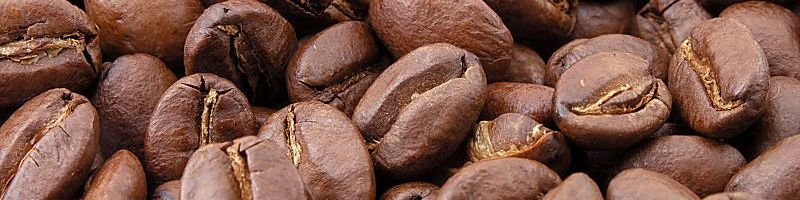

  

 

[コーヒー Advent Calendar 2015](http://www.adventar.org/calendars/895) の 13 日目の記事です.

私はよく, 生豆の店で焙煎してもらった豆を買い, 家で挽いてハンドドリップで抽出して飲んでいます.  
豆は毎回別の産地のものを買って, 違いを味わうのがちょっとした楽しみです.

そのようにコーヒーは好きなのですが, 空腹時に何杯も飲むと調子が悪くなることがあります.  
今回の記事はその原因であろう成分, カフェインについて書きます.

Caffeine
--------

カフェインは, コーヒー (0.8 ~ 2.3 %), 茶 (2 ~ 4 %), ココア (0.05 ~ 0.8 %), コーラ (2 ~ 4 %) など嗜好品として最も多く用いられる中枢興奮薬であり, また, 頭痛薬 (特に片頭痛, 高血圧性頭痛) や風邪薬に配合され, 医薬品としても用いられる.

##### 化学構造

カフェイン. キサンチン誘導体. アルカロイド. 水には微溶.

キサンチンのメチル誘導体としては他にテオフィリン, テオブロミンがある.  
テオフィリンは茶, テオブロミンはココアなどに含まれる.

##### 作用機序

1.  ホスホジエステラーゼの阻害による cAMP の増加
2.  アデノシン受容体の非特異的拮抗作用
3.  細胞内貯蔵 Ca2+ の遊離促進作用

これらの内, アデノシン受容体拮抗作用は言及されることが多いと思う.

アデノシン. アデニンとリボースからなるヌクレオシド.

カフェインはアデニンと同じくプリン骨格を有しているので, 拮抗作用も想像に難くない.

##### 薬理作用

- 中枢神経系
  - 大脳皮質及び延髄中枢の興奮を起こす.
  - 常用量で覚醒, 不穏, 精神緊張を生じ, 知覚及び運動機能が高められる.
  - 呼吸中枢, 血管運動中枢, 迷走神経中枢興奮が起こり, 麻酔薬などによる中枢抑制と拮抗する.
  - 脳細動脈に作用して収縮させ脳血流量を減少させるので脳圧亢進性血管拡張性頭痛に効果がある.
  - 大量では脊髄反射が亢進し, 間代性痙攣が起こる.
- 骨格筋
  - 疲労感の減退, 活動性増大が起こる.
  - 骨格筋に直接作用して, 酸素消費, 熱産生の増大を起こし, 筋小胞体からの Ca2+ の遊離によって筋収縮が生じる.
- 心筋・平滑筋
  - カフェインと比べてテオフィリン, テオブロミンの方が末梢作用が強い.
  - 心筋や平滑筋細胞内に cAMP が増大し, \\(\beta\\) アドレナリン受容体刺激様の心筋興奮 (\\(\beta\\)1 作用) や平滑筋収縮作用 (\\(\beta\\)2 作用) が現れる.
  - 心機能亢進, 末梢血管拡張や気管支筋弛緩作用が見られる.
- 利尿作用
  - テオフィリンが強く, カフェインは弱い.
  - カフェインの利尿は mirror diuretics と呼ばれ, 循環系に作用し腎血流が増大して利尿が起こる.
- その他
  - カフェインは胃液分泌亢進作用が強く, 胃潰瘍の発生を促すことがある.
  - 胃酸分泌を誘起するヒスタミン H2 受容体刺激はアデニル酸シクラーゼを活性化し, カフェインがホスホジエステラーゼを阻害して, cAMP の増加の結果, 胃酸分泌を増大させる.

##### 耐性・依存・副作用

- 中枢神経作用に耐性は生じないが, 利尿作用や血管拡張作用には耐性が生じる.
- 軽度の習慣性が生じる.
- 不眠, 不穏, 神経興奮, 感覚障害, 骨格筋緊張, 振戦, 頻脈, 呼吸促進が見られる.
- 動物に大量投与すると, 痙攣で死亡する.

##### トピックと雑感

精神医学の世界的な診断基準を示す米精神医学会の[「精神障害の診断と統計の手引き」の第 5 版 (通称 DSM-5) ](https://www.amazon.co.jp/dp/4260019082?tag=dceoy-22&camp=1027&creative=7407&linkCode=as4&creativeASIN=4260019082&adid=1DWGJR5CR7M3KJ4WJMCQ&)には, カフェイン中毒とその禁断症状が診断名として含まれている.  
[エナジードリンクによる死亡例](http://www.afpbb.com/articles/-/2908471?pid=9720273)では製造会社を相手取った訴訟も起こり話題になった.

ただ, 日常飲む量のコーヒーなら致死量に達することはまずなく, 大きな副作用も出にくいと思われる.
(小児や肝臓や腎臓の機能が低下している場合は, 耐容量が小さいかもしれない.)

恐らく気になるのはごく稀な死亡のリスクより, 胃痛のような, 軽いが頻度の高い副作用だろう.  
副作用が出ないように気を遣うなら, コーヒーの摂取量を抑えるのも 1 つの手だが, 飲み方を工夫するのも良いと思う.

薬物の話題では摂取量が大きく取り上げられがちだが, 経口ならばその薬物動態も場面によって異なる.   
例えば, 同じ量のコーヒーを飲んだとしても, 空腹時と食後では, 後者の方が全身の血液循環に入るカフェインの量が少ない.

これを気を留め, コーヒーを飲むのは食事の後にしたり, 一緒にお菓子を食べたりすれば, カフェインを取り過ぎずにコーヒーを楽しめるのではないかと思う.

参考文献
--------

1.  [田中 千賀子, 加藤 隆一 (2007). NEW 薬理学 改訂 5 版, 南江堂.](https://www.amazon.co.jp/dp/4524260889?tag=d4i03-22&camp=1027&creative=7407&linkCode=as4&creativeASIN=4524260889&adid=1P222BQPSD2BZV67CGPW&)
2.  [Caffeine, Wikipedia.](https://en.wikipedia.org/wiki/Caffeine)
3.  [Adenosine, Wikipedia.](https://en.wikipedia.org/wiki/Adenosine)
4.  [Sumathi Reddy (2013), カフェインの禁断症状、米精神医学会の新基準で診断名の1つに (A Coffee Withdrawal Diagnosis), WSJ.](http://jp.wsj.com/articles/SB10001424127887324449604578538770871505996)
5.  [カフェイン過剰摂取で少女死亡、遺族が栄養飲料製造会社を提訴, AFPBB News.](http://www.afpbb.com/articles/-/2908471?pid=9720273)
6.  [Heidi Mitchell (2014), コーヒー過飲すればカフェイン中毒 功罪はなお議論の的 (How Much Caffeine Is Too Much?), WSJ.](http://jp.wsj.com/articles/SB12072851737206304029704580241490656021642)

あとがき
-------

最初はコーヒーに関連したデータ分析でもしようと考えていたのですが, 時間がなかったのでコーヒーの成分であるカフェインについて書きました.  
調べてまとめるだけなら余裕だと思ったのに意外と時間がかかった...

